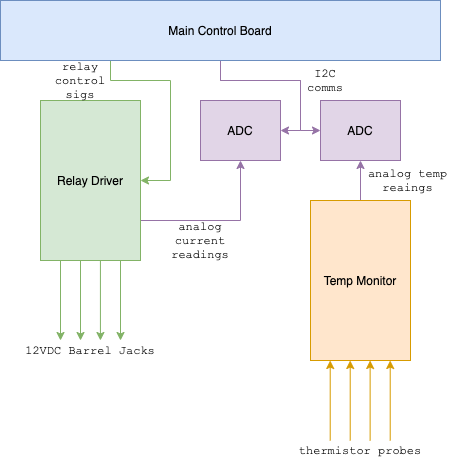
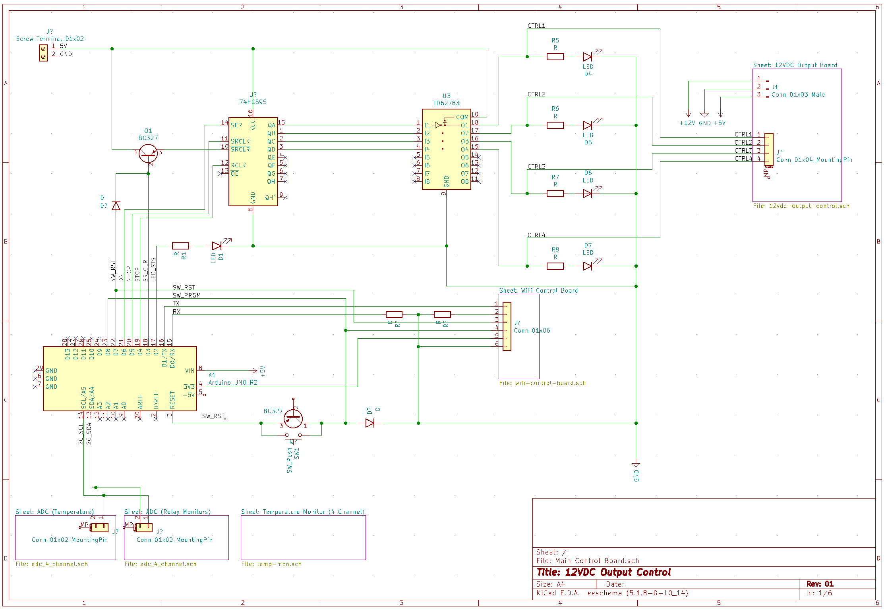
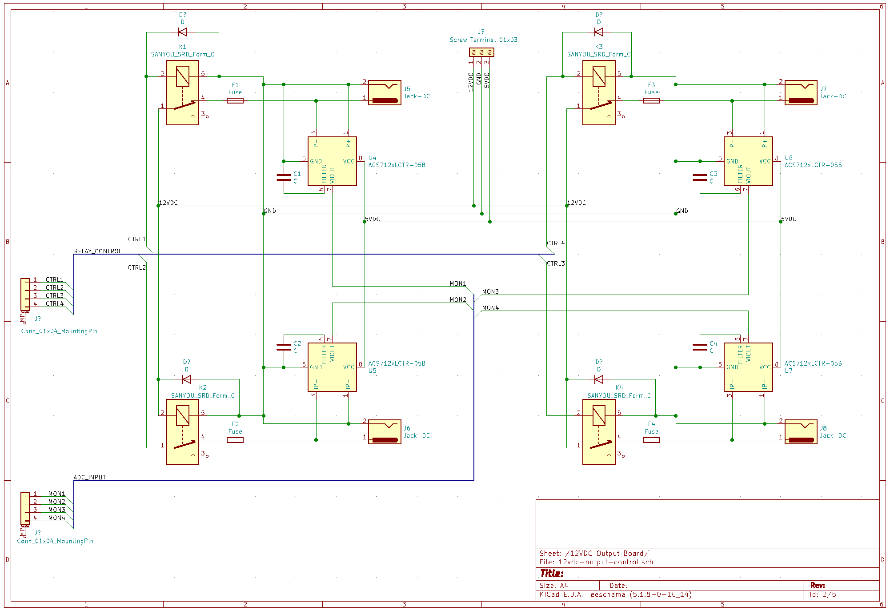
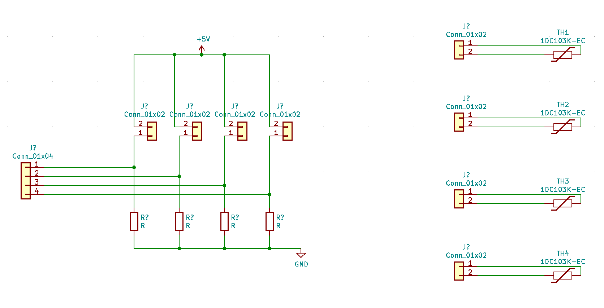
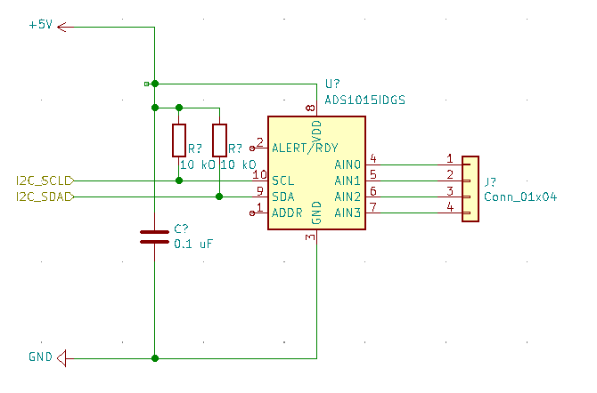

# WiFi Security Monitor: Hardware

All datasheets and schematics are contained in this directory.

This is my first hardware project - other than a few simple Arduino based projects - so it's likely a little rough around the edges!

## Hardware Design

1. Detection of the presence of a functional load (or blown fuse) via the ASC712 current sensor;
2. status LEDs for WiFi, relay output, and overall health;
3. both hardware based (i.e pushbutton) and software triggered reset of microcontroller, wifi, and output buffer (shift register);
4. programmatic control of the ESP01 mode - allowing programming without any manual intervention;
5. a simple HTTP based API for controlling power output and viewing the status of all peripherals;

#### Hardware Considerations

This could be simplified quite a bit via the use of an ADC (for current sensors as well ), a WiFi enabled controller like the NodeMCU (reducing the use of an ESP8266/ESP-01 in addition to the Uno),and perhaps a transistor array for the control of ESP01 mode and reset functionalities. 

This is very rough, and likely going to be subject to a lot of experimentation and refactoring.

## Block Diagram

## Schematics

### Main Control Board

**Schematic:** Main Control Board.sch

The Main Control Board contains the circuitry needed to drive the relay board, provides some basic status LEDs, and opens a WiFi interface via the ESP01.

The Arduino Uno interfaces with a 74HC595 Shift Register, providing 8 output channels, which in turn drives a MIC2981 Current Source Driver Array (i.e Darlington Transistor Array) - powering a status LED and the appropriate Relay found on the Relay Driver Board. 

Interfaces with: Thermistors (via I2C comms w/ ADC), Relay Load Current Sensors (via I2C comms w/ ADC), and Output Board.

Connections:

| Key | Description |
|-----|-------------|
| SW_RST | Software Reset: Clears the 74HC595 shift register and resets both the Uno and ESP01 - by closing their connection to GND.
| SW_PRGM | Software Program: Configures the ESP01 for programming by closing pin GPIO0 to GND.
| I2C_SCL | Connects I2C peripherals via Mounting Pins, SCL line.
| I2C_SDA | Connects I2C peripherals via Mounting Pins, SDA line.
| DS | 74HC595 Interface
| SHCP | 74HC595 Interface
| STCP | 74HC595 Interface
| SR_CLR | Shift Register Clear: Clears the 74HC595 shift register.
| LED_STS | General purpose status indicator.
| TX | Transmission to the ESP01 for WiFi connectivity; line includes voltage divider to drop logic to 3.3V.
| RX | Data from the ESP01 for WiFi connectivity.

Integrated Circuits:

| Name | Description |
|------|-------------|
| 74HC595 | Ubiqitous 8 channel Shift Register
| MIC2981 | High Current Source Driver
| ESP-01  | ESP8266-based WiFi interface
| Arduino Uno | ATmega328P-based microcontroller; used for prototyping, likely to be swapped out.

Components:

*TBC*

### Relay Control Board

**Schematic:** 12vdc-output-control.sch

The Relay Control Board drives 12VDC to 4 DC Barrel Jack connections, complete with current monitoring and over-current protection.

The board consists of four Sanyou SRD relays, powering a DC Barrel Jack with an inline fuse. Current is monitored via an ACS712 IC.

Connections:

| Line | Description |
|------|-------------|
| CTRL{1..4} | Relay Control; input provided via Mounting Pins, driving power directly to the relays.
| MON{1..4} | Current Monitoring output, taken via the ACS712 current sensor. Is directed to an ADC board.

Integrated Circuits:

| Name | Description |
|------|-------------|
| ACS712 | Hall-Effect-Based Linear Current Sensor

Components:

### Temperature Monitoring Probes

**Schematic:** temp-mon.sch

The Temperature Monitoring Probes are simply an array of voltage dividers utilising thermistors, allowing temperature to be calculated based upon the overall output voltage. The values from the thermistors are sent to an ADC Board.

Components:
*TBC*

### 4 Channel ADC Board

**Schematic:** adc_4_channel.sch

The ADC Board is built around the ADS1015 Analog to Digital Converter; and provides an I2C interface for reading values, and a 4-pin header for providing 5V analog signals.

Integrated Circuits:

| Name | Description |
|------|-------------|
| ADS1015 | Analog-to-Digital Converter

### WiFi Interface Board

This board breaks out the ESP01 and provides an interface for (a) serial communications, (b) programming, and (c) reset functionality.

Integrated Circuits:

| Name | Description |
|------|-------------|
| MAX4528 | Analog Switch |