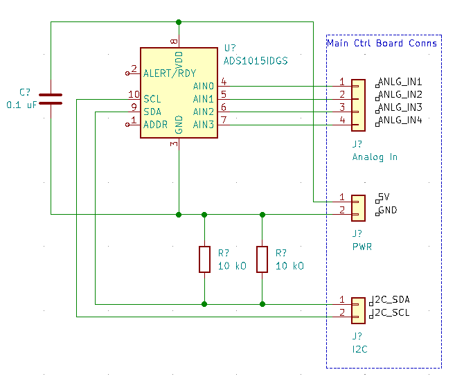

# Analog to Digital (I2C) Module

The Analog-to-Digital Module simply provides a wrapper around the ADS1015 ADC IC, with an I2C interface for reading values, and a 4-pin header for providing 5V analog signals.

## Schematic

### I/O

| Name | Description |
|------|-------------|
| ADS1015 | Analog-to-Digital Converter |

### Pinout

| Junction | Pin | Description |
|----------|-----|-------------|
| J1 | 1 | Analog In 1 |
| J1 | 2 | Analog In 2 |
| J1 | 3 | Analog In 3 |
| J1 | 4 | Analog In 4 |
| J1 | 5 | 5V |
| J1 | 6 | GND |
| J2 | 1 | I2C SDA |
| J2 | 2 | I2C SCL |
