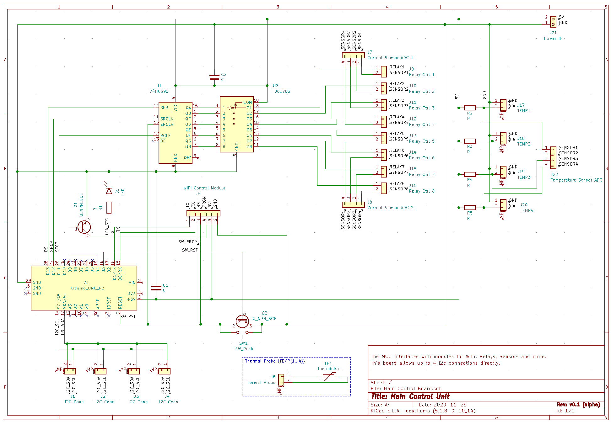

# Main Control Board

The Main Control Board contains the circuitry needed to drive the relay and WiFi boards, monitor both Analog and Digital (via I2C) sensors, and provide basic status LEDs and hardware reset and buttons.

## Schematic

### I/O

| Name | Description |
|------|-------------|
| MAX4528 | Analog Switch - used for switching rx/tx pair mapping with the Main Control Board |
| 74HC595 | Ubiqitous 8 channel Shift Register
| TD62783 | 8 Channel Voltage Source Driver
| Arduino Uno | ATmega328P-based microcontroller; used for prototyping, likely to be swapped out.

### Pinout

*TBC - Still changing*

| Junction | Pin | Description |
| J1-4 | - | Relay Control IN |
| J5 | - | Current Sensor OUT |
| J6 | - | 5V |
| J7-8 | - | GND |
| J9-16 | - | 12VDC - Power for Relay Load |
| J17-20 | - | Barrel Jack - 12VDC OUT |

