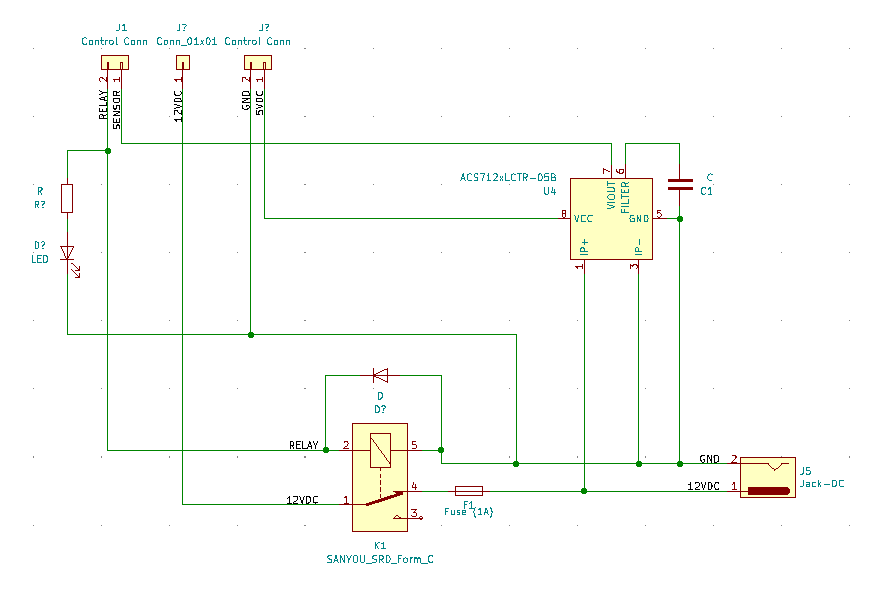

# Relay Control Module 

The Relay Control Module provides a 4 pin interface for controlling the output of a single relay, providing a modular way of adding/removing relay outputs.

## Schematic

### I/O

| Name | Description |
|------|-------------|
| ACS712 | Hall-Effect-Based Linear Current Sensor - monitors relay load |

### Pinout

| Junction | Pin | Description |
|----------|-----|-------------|
| J1 | 1 | Relay Control IN |
| J1 | 2 | Current Sensor OUT |
| J1 | 3 | 5V |
| J1 | 4 | GND |
| J2 | 2 | 12VDC - Power for Relay Load |
| BJ | - | Barrel Jack - 12VDC OUT |