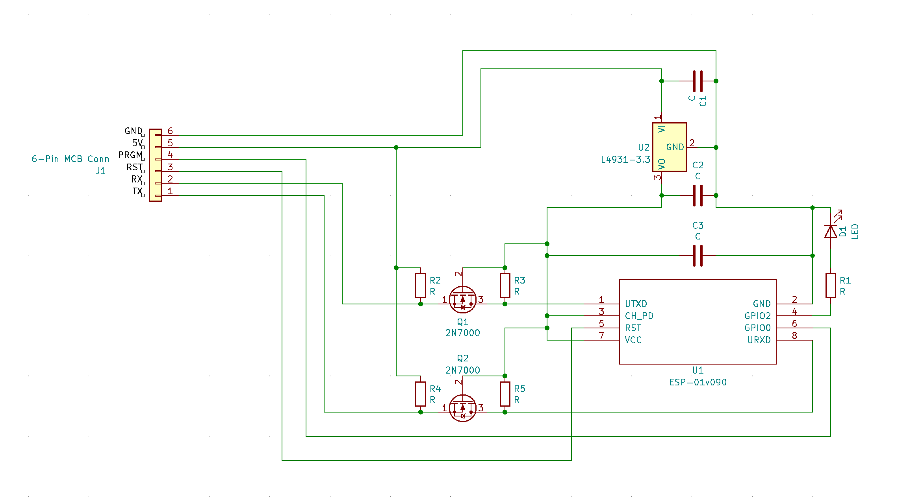

# WiFi Control Module

The WiFi Control Module provides a 6 pin interface with an ESP8266, including the ability for (a) programming, (b) reseting, and (c) UART communications. Voltage regulation for the 3.3v power required by the ESP8266 is done via a L4931-3.3.

## Schematic

### I/O

| Name | Description |
|------|-------------|
| ESP8266 | WiFi interface IC - runs a secondary firmware, also written via the Arduino API/SDK |

### Pinout

| Junction | Pin | Description |
|----------|-----|-------------|
| J1 | 1 | RX (UART) |
| J1 | 2 | TX (UART) |
| J1 | 3 | PRGM - pull low/short to GND to enable programming mode on the ESP8266 |
| J1 | 4 | RST - pull low/short to GND to restart the ESP8266 |
| J1 | 5 | 5V |
| J1 | 6 | GND |
